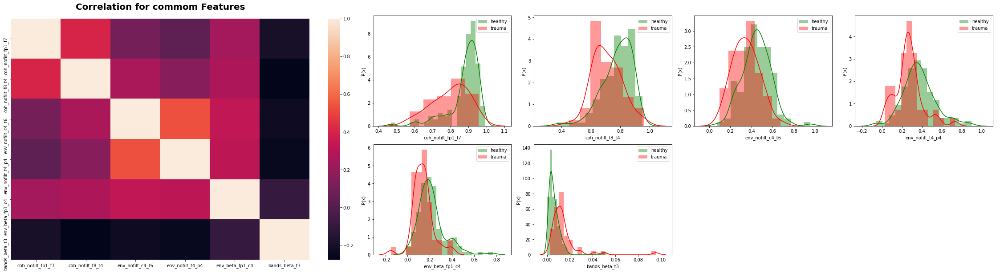

# EEG analysis for Traumatic Brain injury

This repo provide a step-by-step guide line to analyze EEG files to classify patients which got brain trauma from healthy.

### Project team:

> Bruna Faria – Experience with ML (classification/regression tasks), exploring data. PhD student in Computational and Data Science and Engineering (Skoltech).

### Introduction

> Traumatic brain injury can bring serious consequences for people. Due to the rising number of TBI patients, computed tomography or magnetic resonance imaging isn’t useful because of their cost and time consumption. On other hand, the brain injury cause electrophysiologic abnormalities visible on electroencephalography (EEG) becoming this technique combined with machine learning approaches stronger helper in diagnostic and prognostic brain injuries. So, the main goal here is applying ML methods to EEG data to predict brain trauma in patients.

### This project expects to generate a full EEG processing pipeline including:

- Raw data preprocessing
- Feature extraction
- Exploratory data analysis
- Statistical testing
- Machine learning models development

### Main task:

>	Work on the development of a Machine Learning approach for brain trauma using engineering features and checking the preprocessing quality in data.

### Expected results:

> As the final result, the ML pipeline able to explore significant predictors on the data and provide better-quality metrics for helping to distinguish people suffered from brain trauma in past from healthy controls.

### Project Adviser:

> Alexander Ledovsky, Research Engineer of Skolkovo Institute of Science and Technology (Skoltech), Moscow.
________________________________________________

# Workflow:

> 1) Preprocessing EEG files:

**- Preprocessing.ipynb**

- Getting number and names of channels based on the international guideline:

prefrontal = fp1,fp2 | frontal = f7,f3,f4,fz,f8 | central/temporal = t3,c3,cz,c4,t4 | parietal = t5,p3,pz,p4,t6 | occipital = o1,o2

> 2) Features Engineering:

**- FeaturesEngineering.ipynb**

- Relative band power (Ratios)
- Envelop spectrum of each bandT  
- Spectral connectivity (Coherence)    
- Psi

> 3) Extraction of features:

**-ExtractingFeatures.ipynb**

- Compute ROC-AUC single features
- Statictical tests
- Selecting Features

> 4) Exploratory Data Analysis:

**- ExploratoryAnalysis.ipynb**

- Commom features
- Correlation
- Distiguish between Trauma and Healthy

> 5) ML classification models:

**- MLClassification.ipynb**

________________________________________________

# RESULTS SUMMARY:

> From preprocessing step was recorded 185 subjects to get features.

> In features engineering was create a dataset with 1450 features.

> Using different methods to feature extraction was generated 5 datasets:

* a) Features from ROC-AUC > 0.70: 133 features
* b) Features from paired test: 173 features
* c) Features from z-test: 164 features
* d) Features with correlation < 0.75: 107 features
* e) Features from correlation with p-value < 0.05: 26 features

> 6 Commom features for a,b,c,d generating dataset 'f': 'coh_nofilt_fp1_f7', 'coh_nofilt_f8_t4', 'env_nofilt_c4_t6', 'env_nofilt_t4_p4', 'env_beta_fp1_c4', 'bands_beta_t3'

> 1 Feature present in all (a-e): 'bands_beta_t3'

> One more dataset 'g' was generated using Random Forest Classification and Recursive Feature Elimination (29 features).

> The datasets: all features, correlation with p-value (e), intersection (f) and recursive (g); was submited to ML classification methods.

> All results are showed in cometML.

# External link to CometML:

https://www.comet.ml/bfaria/eeg-trauma/view/

_________________________________________________
#### References:

- Dhivya, S., & Nithya, A. (2018). A Review on Machine Learning Algorithm for EEG Signal Analysis. Proceedings of the 2nd International Conference on Electronics, Communication and Aerospace Technology, ICECA 2018. https://doi.org/10.1109/ICECA.2018.8474801
- Gemein, L. A. W., Schirrmeister, R. T., Chrabąszcz, P., Wilson, D., Boedecker, J., Schulze-Bonhage, A., Hutter, F., & Ball, T. (2020). Machine-learning-based diagnostics of EEG pathology. NeuroImage. https://doi.org/10.1016/j.neuroimage.2020.117021
- Hosseini, M. P., Hosseini, A., & Ahi, K. (2020). A Review on Machine Learning for EEG Signal Processing in Bioengineering. IEEE Reviews in Biomedical Engineering. https://doi.org/10.1109/RBME.2020.2969915
- Lai, C. Q., Ibrahim, H., Abd Hamid, A. I., Abdullah, M. Z., Azman, A., & Abdullah, J. M. (2020). Detection of Moderate Traumatic Brain Injury from Resting-State Eye-Closed Electroencephalography. Computational Intelligence and Neuroscience. https://doi.org/10.1155/2020/8923906
- Li, S., Zhou, W., Yuan, Q., Geng, S., & Cai, D. (2013). Feature extraction and recognition of ictal EEG using EMD and SVM. Computers in Biology and Medicine. https://doi.org/10.1016/j.compbiomed.2013.04.002
- Lotte, F., Bougrain, L., Cichocki, A., Clerc, M., Congedo, M., Rakotomamonjy, A., & Yger, F. (2018). A review of classification algorithms for EEG-based brain-computer interfaces: A 10 year update. In Journal of Neural Engineering. https://doi.org/10.1088/1741-2552/aab2f2
- Siuly Siuly, Li, Y., & Zhang, Y. (2016). EEG Signal Analysis and Classification Techniques and Applications. In Springer.
- Thatcher, R. W., North, D. M., Curtin, R. T., Walker, R. A., Biver, C. J., Gomez, J. F., & Salazar, A. M. (2001). An EEG severity index of traumatic brain injury. Journal of Neuropsychiatry and Clinical Neurosciences. https://doi.org/10.1176/jnp.13.1.77

